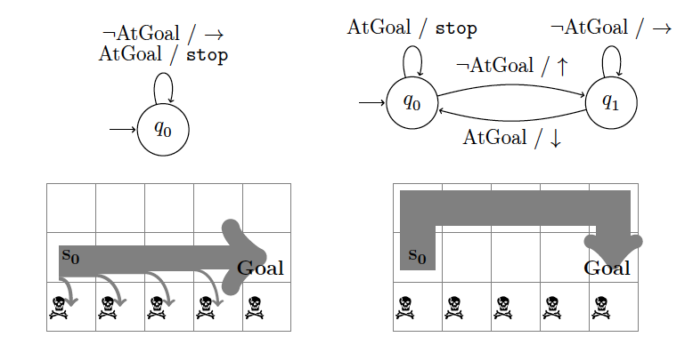

# Probabilistic AND-OR search algorithm for finite state controllers in a stochastic environment

Based on the Master's thesis of Laszlo Treszkai at the University of Edinburgh, MSc in AI, 2018. Supervisor: [Vaishak Belle](http://vaishakbelle.com/).

Repository structure:

 - `source`
   - `pandor.py`: The Pandor algorithm for FSC synthesis in noisy environments.
   - `controller.py`: Class for Mealy machines.
   - `environments.py`: Definitions of environments.
 - `logs`: Logs of runs on the environments below.

## Test environments

### WalkThroughFlapProb

Toy environment to test that the controller satisfies desideratum D2.

1x4 gridworld. No overflow at edges.

States:
 - States 0 to 3. Actions -1/+1. Doing -1 in state 2 leaves the agent in place with 0.9 probability; otherwise all actions have a natural outcome.
 - Start state. Action _init_ brings to states 2 and 1, with probabilities 0.7 and 0.3.

Goal states: 0 and 3.

Observation: init/True/False, whether in init/goal/not goal.

### ProbHall-A-one

Noisy version of the 1-dimensional Hall-A environment, defined in Bonet, Palacios, Geffner: _Automatic Derivation of Memoryless Policies_ (2009).

Every action has the desired outcome with 0.5 probability and leaves the state unchanged otherwise.

Goal is to walk from one end (A) to the other (B) and back. Observation: A/–/B.

### ProbHall-A-rect

Noisy version of the 2-dimensional Hall-A environment, defined in Bonet, Palacios, Geffner: _Automatic Derivation of Memoryless Policies_ (2009).

Noisy action outcomes like in the 1-dim case. For details, see the BPG2009 paper.

### BridgeWalk

3*(n+1) gridworld, no overflow. Intuitively: like walking on the handrail of a bridge: usually you get to the goal, but sometimes you end up in the river.

States: (0,-1) to (n,+1). States (k,-1) are _dead ends_: no action changes the state.
Initial state: (n,0)
Goal state: (0,0).
Observation: Whether first coordinate is zero or not. (Alternative version: second coordinate.)

Actions:
 - right: add (0,-1). Outcome deterministic (if not in dead end).
 - left: add (0,+1). Outcome deterministic (if not in dead end).
 - forward: add (-1,0).
    - Outcome in (k,+1) is deterministic.
    - Outcome in (k,0) is (k-1,0) with 0.9 chance; (k,-1) with 0.1 chance (i.e. ending in a dead end state).

BridgeWalk environment for n=4:

Two possible FSCs for the above environment, with all of their runs. Left: controller with **LGT**≈0.67. Right: controller with **LGT**=1.

